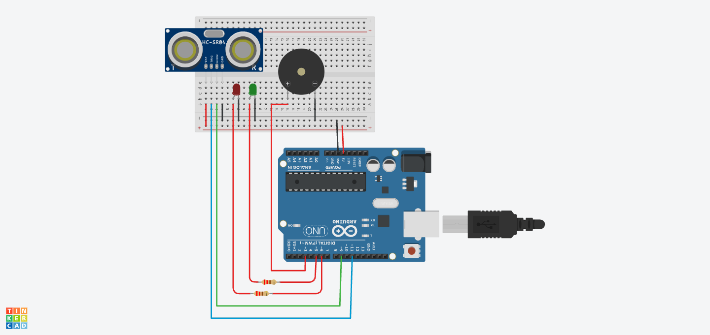

# Formative 1 - C Programming

This repository contains my solutions for the Formative 1 C Programming project. 
The project contains four questions covering C program development, control flow, functions, recursion, and an Arduino-based embedded system.

## Project Structure

```text
Formative1-C_Programming/
│
├── question1_water_monitoring/
│   └── main.c
│
├── question2_mobile_money/
│   └── main.c
│
├── question3_recursive/
│   └── main.c
│
├── question4_smart_parking/
│   ├── smart_parking.ino
│   └── smart_parking_circuit.png
│
├── CMakeLists.txt
├── Project_Explanation.pdf
└── README.md
```

## Question 1: Water-Quality Monitoring System

This program simulates a water-quality monitoring system. It generates temperature and turbidity readings, calculates the water-quality index, and classifies the result as:

- Good
- Warning
- Critical

The program generates ten sensor readings using random numbers by loop and waits for two seconds between each reading to imitate how a real sensor takes readings repeatedly.

Source code: [Question 1](question1_water_monitoring/main.c)

## Question 2: Mobile-Money Transaction System

This is a menu-based mobile-money transaction program. It allows the user to:

- Deposit money
- Withdraw money
- Check the account balance
- View the transaction summary and history
- Exit the program

The program validates the user’s input and prevents invalid deposits, withdrawals below the required amount, and withdrawals above the available balance. It also stores successful transaction types, amounts, and date/time.
- Deposit Limit used: 100RWF
- Withdrawal Limit Used: 50RWF
Source code: [Question 2](question2_mobile_money/main.c)

## Question 3: Delivery Distance Analysis

This program asks the user to enter the number of delivery routes, each route distance, and a distance limit. It then calculates:

- Total distance
- Average distance
- Longest route
- Number of routes above the distance limit
- Recursive sum of all distances
all inputs are validated correctly for errors with a clear error message
The program uses separate functions for the different calculations. It also uses a recursive function with a clear base case to calculate the sum of the distances.

Source code: [Question 3](question3_recursive/main.c)

## Question 4: Smart Parking System

This is an Arduino-based smart parking system created and simulated using Tinkercad.

The system uses:

- Arduino Uno
- HC-SR04 ultrasonic sensor
- Green LED
- Red LED
- Active buzzer
- Two 220-ohm resistors
- Breadboard and jumper wires

The ultrasonic sensor measures the distance between the sensor and a vehicle. The Arduino compares the measured distance with a threshold of 50 cm.

- When the distance is above 50 cm, the green LED turns on to show that the parking space is available.
- When the distance is 50 cm or below, the red LED and buzzer turn on to show that the parking space is occupied.

Arduino code: [Smart Parking Code](question4_smart_parking/smart_parking.ino)

Circuit design:



## How to Clone and Run the Project Using VS Code

### Requirements

Install the following:

- Visual Studio Code
- Git
- A C compiler such as GCC or Clang
- CMake
- The **C/C++** extension in VS Code
- The **CMake Tools** extension in VS Code

### Clone the Repository

1. Open Visual Studio Code.
2. Open the Command Palette:
    - Windows/Linux: `Ctrl + Shift + P`
    - macOS: `Command + Shift + P`
3. Search for and select **Git: Clone**.
4. Enter the repository address:

```text
https://github.com/helen751/Formative1-C_Programming.git
```

5. Select the folder where the project should be saved.
6. Select **Open** when VS Code asks whether to open the cloned repository.

### Configure the Project

1. Open the Command Palette.
2. Search for and select **CMake: Configure**.
3. Select an available C compiler if VS Code asks you to choose one.
4. Wait for CMake to finish configuring the project.

### Run a Question

1. Open the Command Palette.
2. Select **CMake: Set Build Target**.
3. Choose one of the following targets:

```text
question1
question2
question3
```

4. Select **CMake: Build**.
5. Select the required program as the launch target.
6. Use the Run button in VS Code to start the selected program.

## How to Clone and Run Using the Terminal

Clone the repository:

```bash
git clone https://github.com/helen751/Formative1-C_Programming.git
```

Enter the project folder:

```bash
cd Formative1-C_Programming
```

Configure the project:

```bash
cmake -S . -B build
```

Build all three C programs:

```bash
cmake --build build
```

### Run on macOS or Linux

Run Question 1:

```bash
./build/question1
```

Run Question 2:

```bash
./build/question2
```

Run Question 3:

```bash
./build/question3
```

### Run on Windows

Depending on the CMake generator, the executable files may be inside the `build` or `build/Debug` folder.

```powershell
.\build\Debug\question1.exe
.\build\Debug\question2.exe
.\build\Debug\question3.exe
```

Question 4 is an Arduino program and should be opened and simulated in Tinkercad using the code inside `smart_parking.ino`.

## Project Explanation and Test Results

The complete explanations, sample outputs, error analysis, compilation lifecycle, recursion explanation, circuit screenshots, smart-parking test cases, and block diagram are included in:

[Project Explanation PDF](Project_Explanation.pdf)

## Author

Helen Ugoeze Okereke